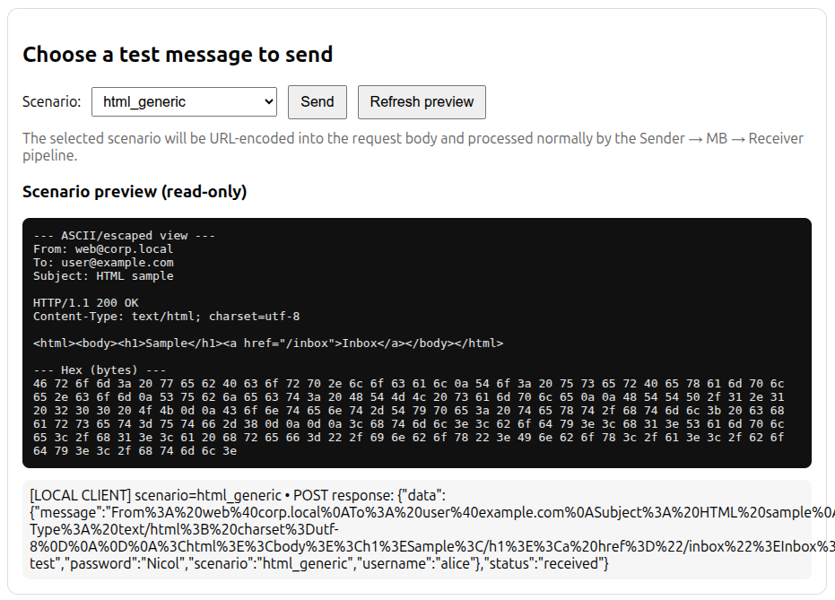
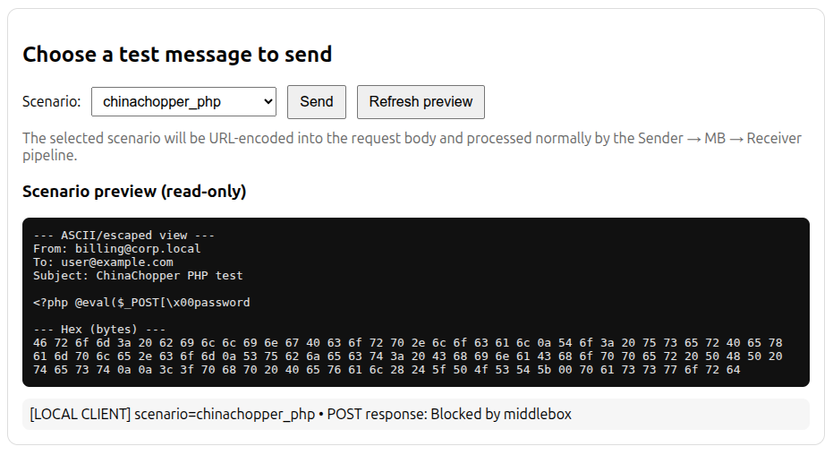

# P2DPI-Telecom

P2DPI-Telecom implements the protocol described in `article.pdf`, adapting the privacy-preserving DPI design to a Sender → Middlebox → Receiver pipeline. The stack combines deterministic tokenisation, elliptic-curve PRFs, and translated YARA rules sourced from [Yara-Rules/rules](https://github.com/Yara-Rules/rules). This guide captures the end-to-end setup, the rule translation format, and runtime behaviour so anyone can reproduce the environment.

## 1. Prerequisites
- Linux or macOS shell (validated on Ubuntu 22.04).
- Python 3.12 with `pip`, plus the packages listed in `requirements.txt`.
- OpenSSL CLI to rebuild the internal PKI.
- Build essentials (gcc, make) already included for the bundled `prf.so` library.

## 2. Getting Started
1. **Create/activate a virtual environment (optional).**
   ```bash
   python -m venv my_env
   source my_env/bin/activate
   pip install -r requirements.txt
   ```
2. **Configure `.env`.** Adjust all endpoints and certificate paths. `SENDER_PUBLIC_URL` and the `RECEIVER_*` URLs must reference hostnames/IPs present in the TLS certificates.
   _Note: if you do not need to change these values you can skip this step._
3. **Regenerate certificates.** `ca/entrypoint.sh` wipes prior material and issues a fresh CA plus Sender/Receiver/Client/Server certificates, each with multi-SAN support (`sender.p2dpi.local`, `localhost`, `127.0.0.1`, `192.168.1.55`).
   ```bash
   cd ca
   bash entrypoint.sh
   cd -
   ```
   _Note: once the issuance finishes you can leave `entrypoint.sh` running or exit with `Ctrl+C`; the certificates are already generated._
4. **Redistribute PRF secrets.**
   Start `main/receiver/receiver_http.py`, `main/sender/sender_http.py`, and `main/mb/mb_main.py` before running these scripts so the keys reach their destinations.
   ```bash
   python main/rule_generator/generate_kmb.py      # Rule Generator → Middlebox (kMB)
   python main/sender/send_ksr.py                  # Sender → Receiver (kSR)
   ```
5. **Launch each service (separate shells).**
   Stop any previously running instance (`Ctrl+C`) to avoid conflicts and launch each service fresh.
   ```bash
   python main/mb/mb_main.py
   python main/sender/sender_http.py
   python main/receiver/receiver_http.py
   python main/receiver/receiver_https.py
   python main/sender/sender_https.py
   ```
6. **Load rules.**
   ```bash
   python main/rule_generator/rg.py
   ```
7. **Exercise scenarios.** Visit `https://<sender-host>:8443/test_menu`, accept the self-signed cert, and send the sample payloads to observe Middlebox verdicts. For local tests you can point your browser to `https://127.0.0.1:8443/test_menu` as an example sender host.

## 3. Architecture Summary
- **Sender HTTPS** normalises payload bytes, emits 8-byte sliding plus canonical tokens, encrypts them with kSR, posts them to the MB, and forwards the original request to Receiver HTTPS when allowed.
- **Sender HTTP / Receiver HTTP** validate RG signatures on obfuscated tokens, raise them to kSR, and return intermediates to the MB.
- **Middlebox** ingests RG rules, waits for matching intermediates, reconstructs session tokens Sj using kMB, and evaluates encrypted traffic in real time. Once a batch finalises (`status: finalized`), enforcement kicks in.
- **Receiver HTTPS** stores ciphertext tokens from the MB, validates tokens sent by the Sender, and hands the decoded payload to the backend application.

## 4. Rule Translation (YARA → Dictionary)
Following the detections discussed in `article.pdf`, we imported signatures from [Yara-Rules/rules](https://github.com/Yara-Rules/rules) into `main/rule_generator/dictionary.json` using this schema:

```json
{
  "groups": {
    "prefix1": {
      "match_type": "any",
      "strings": [
        { "data_type": "string", "value": "_VBA_PROJECT_CUR" },
        { "data_type": "hex", "value": "41 74 74 72 69 62 75 74 00 65 20 56 42 5F" }
      ]
    },
    "groupN": {
      "match_type": "cadena",
      "data_type": "hex",
      "strings": [
        { "id": "groupN_s0", "value": "AA BB CC" },
        { "id": "groupN_s1", "value": "DD EE" }
      ]
    }
  },
  "conditions": [
    { "sequence": { "group": "groupN", "from": "groupN_s0", "to": "groupN_s1", "op": "ONE_WILDCARD" } },
    { "groups": ["prefix1", "prefix2"], "operator": "and" }
  ]
}
```

Translation guidelines:
- Hex strings with gaps/wildcards become `match_type: "cadena"` groups with enumerated segment IDs. Conditions describe the allowed wildcard range (`ONE_WILDCARD`, `RANGE_m_n`, etc.).
- Plain string/hex lists retain `match_type` values `any`, `all`, or numeric codes such as `"14"` to match the original semantics.
- Complex clauses (e.g., officemagic/XML rules) are modelled via nested OR-of-AND blocks inside `conditions`.
- Regex-only YARA rules are skipped—the deterministic tokeniser lacks a lossless translation for them.

This mapping preserves the detection intent while generating deterministic token sequences compatible with the Sender tokeniser.

## 5. Tokenisation Mechanics
1. **Normalised view**: ASCII letters lowercased where applicable, percent-decoding applied, intra-line whitespace collapsed.
2. **Sliding-8 tokens**: every 8-byte window is emitted. Payloads ≤7 bytes still propagate; 7-byte hexadecimal inputs are expanded across all possibilities to avoid blind spots. Missing characters simply leave unmatched tokens.
3. **Canonical tokens**: header fragments (`to: `, `host:`, …) appear at the same offsets. Deduplication keeps sliding tokens first and canonical tokens second when bytes differ.
4. **Example around offset K** (`to: nicol`):
   - S0: `74 6f 3a 20 6e 69 63 6f`
   - C0: `74 6f 3a 20 20 20 20 20`
   - S1: `6f 3a 20 6e 69 63 6f 6c`
   - S2: `3a 20 6e 69 63 6f 6c 0d`
   - S3: `20 6e 69 63 6f 6c 0d 0a`
5. **Encryption**: the ordered list feeds `encrypt_tokens(tokens, kSR, counter)`, applying FKH and H2 with counter `c+i`. The MB recovers Sj with kMB and recomputes H2 for verdicts.

## 6. Operations & Troubleshooting
- After regenerating the CA, always re-run `generate_kmb.py`, `send_ksr.py`, and `rg.py`. Otherwise MB batches stall with `202` (missing or mismatched intermediates).
- HTTPS requests must target hostnames present in certificate SANs; otherwise Requests raises `SSLCertVerificationError` and the MB sees 500s when posting to the Receiver.
- The MB only blocks traffic once a batch finalises (`{"status": "finalized"}` in logs). If finalisation never occurs, verify kSR distribution and ensure both sender/receiver HTTP services are running.

## 7. End-to-End Testing
1. Start all services and load rules as described above.
2. Trigger a scenario via `/test_menu` or craft a custom POST to the Sender.
3. Inspect `/receive_tokens` responses on the MB: `status: alert` returns HTTP 403 to the client and notifies Receiver HTTPS to delete stored tokens; `status: ok` allows forwarding.
4. Review Receiver logs to confirm token validation and payload reconstruction.

## 8. Expected Results
Two outcomes appear when you exercise the sample scenarios:
- **Clean traffic** (e.g., `clean_simple_email`, `clean_form_login`, `html_generic`, `pdf_magic_header`, `zip_magic_header`) flows end to end. The Sender confirms delivery and the MB reports `status: ok`.
- **Malicious detections** (web shells such as `chinachopper_aspx`, PDF exploits, maldoc payloads, and other non-clean scenarios) are blocked. The Sender receives an HTTP 403 and the MB logs `status: alert`.





## 9. Limitations
- PCRE-heavy YARA rules remain unsupported.
- The fixed 8-byte window requires sequence conditions for signatures spanning longer contiguous bytes.
- Flask apps run in development mode; production deployments should use gunicorn/uWSGI and secure key storage.

---
This README gives new operators the context required to rebuild the environment, translate YARA rules from `article.pdf`.
